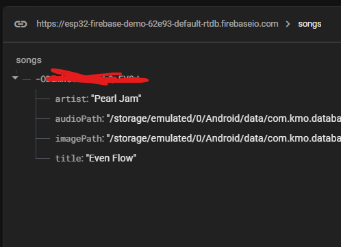
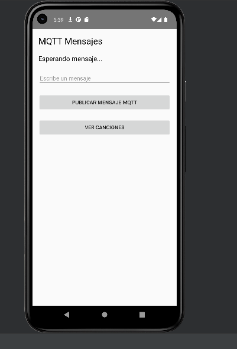

# Proyecto Music Player

## Descripción
Este es un proyecto de reproductor de música que permite al usuario agregar canciones a la aplicación, reproducirlas, y gestionarlas mediante una interfaz en Android. Las canciones se pueden agregar desde el almacenamiento local del dispositivo o desde un servidor en la nube (Firebase).

## Funcionalidades
- **Reproducción de música local**: Permite seleccionar y reproducir canciones almacenadas en el dispositivo.
- **Agregar canciones**: Se pueden agregar canciones a la lista y asociarles una imagen.
- **Conexión con Firebase**: Se pueden almacenar y obtener canciones desde Firebase.
- **Interacción con MQTT**: Publica mensajes relacionados con las canciones a través de un servidor MQTT.

## Pruebas realizadas

### 1. **Prueba de agregar una canción**
- Se seleccionó una canción desde el almacenamiento local y se agregó correctamente a la lista de canciones.
- Pantallazo de la interfaz mostrando la canción agregada.

  [Pantallazo de canción agregada](assets/images/CancionAgregada.png)

### 2. **Prueba de reproducción de música**
- Se seleccionó una canción y se reprodujo correctamente utilizando un reproductor local en la tablet.
- Pantallazo del reproductor funcionando.

  

### 3. **Prueba de sincronización con Firebase**
- Se subió correctamente una canción a Firebase y se recuperó sin problemas desde el servidor.
- Pantallazo mostrando la canción en Firebase.

  

### 4. **Prueba de envío de mensaje MQTT**
- Se envió un mensaje a través del servidor MQTT con la información de la canción y se recibió correctamente en el suscriptor.
- Pantallazo de la consola mostrando el mensaje recibido.

  
  
   
  

## Enlace al repositorio Git
- [GitHub Repository]([tu_enlace_al_repositorio](https://github.com/RKDJ12/DatabaseProyecto/))

## Instalación
1. Clona el repositorio:
   ```bash
   git clone <enlace_git>

Requerimientos
Android Studio
Firebase
MQTT Broker
   
